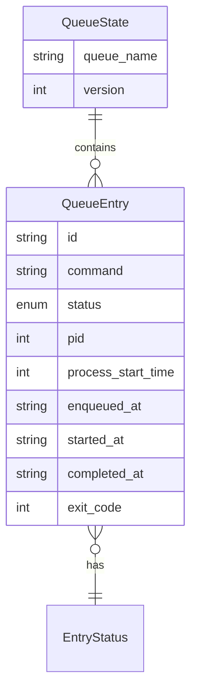

# Data Model: CLI Queue Sequencer

**Feature**: cli-queue-sequencer | **Date**: 2026-08-15

## Entities

### QueueEntry

Represents a single command submission in the queue.

| Field | Type | Description | Constraints |
|-------|------|-------------|-------------|
| `id` | `String` (UUID v4) | Unique identifier for this entry | Generated on creation, immutable |
| `command` | `String` | The shell command to execute | Non-empty, as provided by user |
| `status` | `EntryStatus` | Current execution status | One of: `Pending`, `Running`, `Completed`, `Failed` |
| `pid` | `u32` | Process ID of the `queue run` caller | Recorded for liveness checks |
| `process_start_time` | `u64` | Start time of the caller process (epoch secs) | Used alongside `pid` to detect PID reuse |
| `enqueued_at` | `String` (ISO 8601) | Timestamp when the entry was added to the queue | Set on creation, immutable |
| `started_at` | `Option<String>` (ISO 8601) | Timestamp when the command began executing | `None` until status becomes `Running` |
| `completed_at` | `Option<String>` (ISO 8601) | Timestamp when the command finished | `None` until status becomes `Completed` or `Failed` |
| `exit_code` | `Option<i32>` | Exit code of the wrapped command | `None` until command completes |

### EntryStatus (Enum)

State machine for a queue entry's lifecycle.

```
Pending → Running → Completed
                  → Failed
                  → Cancelled
Pending → Cancelled
```

| Variant | Description |
|---------|-------------|
| `Pending` | Entry is in the queue waiting for its turn |
| `Running` | Entry is currently being executed |
| `Completed` | Entry has finished execution successfully (exit code 0) |
| `Failed` | Entry has finished with a non-zero exit code |
| `Cancelled` | Entry was interrupted by user signal (Ctrl+C / SIGINT / SIGTERM) while pending or running |

### QueueState

Top-level structure persisted to the queue state file.

| Field | Type | Description | Constraints |
|-------|------|-------------|-------------|
| `queue_name` | `String` | Name of this queue | Default: `"main"` |
| `entries` | `Vec<QueueEntry>` | Ordered list of queue entries (FIFO) | Oldest first |
| `version` | `u32` | Schema version for forward compatibility | Currently `1` |

### Validation Rules

- `QueueEntry.command` must be a non-empty string
- `QueueEntry.pid` must be > 0
- `QueueEntry.enqueued_at` must be a valid ISO 8601 timestamp
- `QueueEntry.started_at` must be >= `enqueued_at` when present
- `QueueEntry.completed_at` must be >= `started_at` when present
- `QueueState.entries` maintains insertion order (FIFO) — new entries appended at end
- At most one entry in `QueueState.entries` may have `status == Running` at any time
- Completed/Failed entries are removed from the state file after the owning process reads the result

## File Layout

Queue state is stored in the OS temporary directory:

```
{temp_dir}/queue/
├── main.lock        # Execution lock file (held while a command runs)
├── main.state.lock  # State lock file (held briefly during state reads/writes)
└── main.state.json  # QueueState serialized as JSON
```

Future named queues follow the same pattern:

```
{temp_dir}/queue/
├── {name}.lock
├── {name}.state.lock
└── {name}.state.json
```

Where `{temp_dir}` is:
- Linux/macOS: `$TMPDIR` or `/tmp`
- Windows: `%TEMP%`

## Relationships



## Concurrency Invariants

1. **Mutual Exclusion**: The execution lock (`{name}.lock`) guarantees only one command runs at a time per queue.
2. **State Atomicity**: The state lock (`{name}.state.lock`) ensures all reads/writes to the state file are serialized. State file writes use atomic write-then-rename via `tempfile::NamedTempFile::persist()`.
3. **FIFO Guarantee**: New entries are always appended to the end of `entries`. The entry at index 0 with status `Pending` is the next to execute.
4. **Stale Entry Detection**: On any state file read, entries whose `pid` no longer corresponds to a live process (verified via `sysinfo` with start time comparison) are automatically removed and logged to stderr.
5. **No Zombie Locks**: If the process holding the execution lock has terminated (detected via PID liveness check), the lock file is deleted and recreated, allowing the next waiter to proceed.
